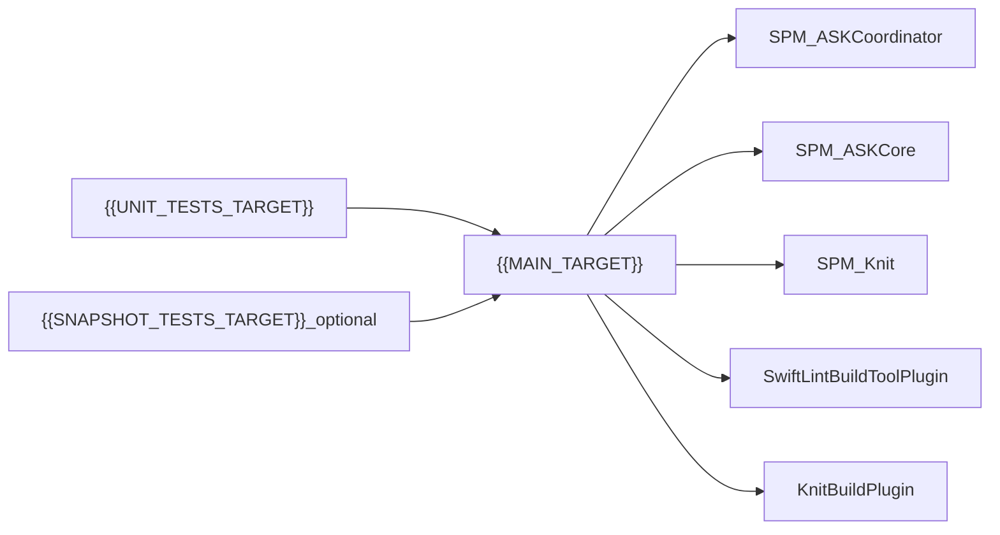

# iOS app scaffold (Items-style layout)

Use this document as the **single source of truth** when an agent should create a **new blank iOS app** that matches the **repository layout, tooling, and core Swift Package stack** of the reference project **Vesprium / Items** (SwiftUI, coordinator navigation, Knit DI). Replace all `{{PLACEHOLDER}}` values before generating files. Optional machine-readable defaults live in [`placeholders.json`](placeholders.json).

---

## 1. Invocation (what to tell the agent)

> Create a new iOS app named **{{APP_NAME}}** with bundle identifier **{{BUNDLE_ID}}**. Use the repository layout, folder structure, Xcode targets, Swift Package dependencies, and root config files exactly as specified in this template. Do **not** copy game content, analytics, server code, or large asset catalogs from any reference app. Produce a **minimal** app that **builds**, **lints**, and runs with a single placeholder screen. Use **SwiftGen** for asset codegen and **Knit** for dependency injection with an assembly file referenced from **`knitconfig.json`**. Link **ASKCoordinator**, **ASKCore**, and **Knit** (including **KnitMacros**). Add **SwiftLint** via the **SwiftLintBuildToolPlugin** package plugin on the main app target. Add the **KnitBuildPlugin** package plugin on the main app target. Include **SwiftLintPlugins** and **Knit** remote packages at the versions/branches listed in §5.

---

## 2. Placeholders

| Placeholder | Meaning | Example |
|-------------|---------|---------|
| `{{APP_NAME}}` | Display name | `MyApp` |
| `{{BUNDLE_ID}}` | Reverse-DNS bundle ID | `com.skorulis.MyApp` |
| `{{PROJECT_FILE}}` | Xcode project filename | `MyApp.xcodeproj` |
| `{{SCHEME}}` | Shared scheme name | `MyApp` |
| `{{MAIN_TARGET}}` | Main app target name | `MyApp` |
| `{{MAIN_FOLDER}}` | On-disk folder for app sources (match target name for clarity) | `MyApp` |
| `{{UNIT_TESTS_TARGET}}` | Unit test bundle target | `MyAppUnitTests` |
| `{{SNAPSHOT_TESTS_TARGET}}` | UI snapshot test target (optional for minimal scaffold) | `MyAppSnapshotTests` |
| `{{ASSEMBLY_FILE}}` | Knit assembly Swift file | `MyAppAssembly.swift` |
| `{{IOS_DEPLOYMENT_TARGET}}` | iOS deployment target string | `18.0`
| `{{ORGANIZATION_IDENTIFIER}}` | Xcode organization identifier | `com.skorulis` |

---

## 3. Repository layout (canonical tree)

Create the **git repository root** with:

```text
{{PROJECT_FILE}}/
  project.pbxproj
  project.xcworkspace/          # embedded workspace (SwiftPM); do not add a second root-level .xcworkspace unless required
  xcshareddata/xcschemes/{{SCHEME}}.xcscheme
{{MAIN_FOLDER}}/
  Scene/
    App/
    Coordinator/
  Model/
  Service/
    App/
      {{ASSEMBLY_FILE}}
  DesignSystem/
  Resource/
    Assets.xcassets/
      AccentColor.colorset/
      AppIcon.appiconset/       # placeholder app icon set
    Fonts/                      # optional; may be empty
    XCAssets+Generated.swift    # generated by SwiftGen; commit or regenerate in CI
  Store/
  Util/
  PrivacyInfo.xcprivacy
{{APP_NAME}}UnitTests/
  (unit test sources; at least one trivial test)
{{APP_NAME}}SnapshotTests/    # optional; omit entire target for a smaller scaffold
  Scene/
  Helpers/
swiftgen.yml
knitconfig.json
.swiftlint.yml
.gitignore
README.md
```

---

## 4. Xcode targets

| Target | Product type | Purpose |
|--------|----------------|---------|
| `{{MAIN_TARGET}}` | iOS application | SwiftUI app entry, coordinator root, Knit assembly |
| `{{UNIT_TESTS_TARGET}}` | Unit test bundle | XCTest; depends on hosting app |
| `{{SNAPSHOT_TESTS_TARGET}}` (optional) | Unit test bundle | Only if you add [swift-snapshot-testing](https://github.com/pointfreeco/swift-snapshot-testing); otherwise omit |

**Test host:** `{{UNIT_TESTS_TARGET}}` and snapshot target must have a **target dependency** on `{{MAIN_TARGET}}`.

**Main app target — resource:** Add **`knitconfig.json`** (repo root) to the app target’s **Copy Bundle Resources** build phase so Knit can resolve config at runtime if required (match reference behavior).

**Main app target — build plugin dependencies (Swift Package):**

- **KnitBuildPlugin** (from Knit package) — `PBXTargetDependency` / plugin product, as in a standard Knit + Xcode setup.
- **SwiftLintBuildToolPlugin** (from SwiftLintPlugins) — same pattern.

**Main app target — Swift package products (link):**

- `ASKCoordinator`
- `ASKCore`
- `Knit`
- `KnitMacros` (same remote Knit package)


**Optional snapshot target — link:** `SnapshotTesting` remote package (add package reference only if you include this target).

---

## 5. Swift Package Manager (required remotes + local)

### Remote packages (URLs and pins from reference **Items**)

Use these **repository URLs**. Prefer the **same requirement kind** (branch vs. version) so resolution stays predictable:

| Package | URL | Reference requirement |
|---------|-----|------------------------|
| ASKCoordinator | `https://github.com/skorulis/ASKCoordinator` | Branch `main` |
| ASKCore | `https://github.com/skorulis/ASKCore` | Branch `main` |
| Knit | `https://github.com/cashapp/knit` | Branch `skorulis/resolver-class` (reference project pin; update if upstream merges) |
| SwiftLintPlugins | `https://github.com/SimplyDanny/SwiftLintPlugins` | Up to next major, minimum `0.60.0` |

**Products to wire:**

- From **Knit:** `Knit`, `KnitMacros`, `plugin:KnitBuildPlugin`
- From **SwiftLintPlugins:** `plugin:SwiftLintBuildToolPlugin`
- From **ASKCoordinator:** `ASKCoordinator`
- From **ASKCore:** `ASKCore`

### Excluded by default (do not add unless asked)

- **AmplitudeUnified-Swift**
- **Vapor**
- **swift-snapshot-testing** (unless you add the optional snapshot test target)

---

## 6. Root configuration files

### 6.1 `swiftgen.yml`

Use **`forceProvidesNamespaces: true`**. Point inputs/outputs at `{{MAIN_FOLDER}}`:

```yaml
xcassets:
  inputs:
    - {{MAIN_FOLDER}}/Resource/Assets.xcassets
  outputs:
    - templateName: swift5
      params:
        forceProvidesNamespaces: true
      output: {{MAIN_FOLDER}}/Resource/XCAssets+Generated.swift
```

Run **`swiftgen`** from the repo root after creating or changing the asset catalog.

### 6.2 `knitconfig.json`

Assembly path must match `{{MAIN_FOLDER}}/Service/App/{{ASSEMBLY_FILE}}`:

```json
{
    "assemblyInputPaths": [
        "{{MAIN_FOLDER}}/Service/App/{{ASSEMBLY_FILE}}"
    ]
}
```

### 6.3 `.swiftlint.yml`

Start from this baseline (adjust `excluded` paths to use `{{MAIN_FOLDER}}`):

```yaml
excluded:
  - {{MAIN_FOLDER}}/Resource/XCAssets+Generated.swift

strict: false

trailing_comma:
    mandatory_comma: true

line_length:
  warning: 120
  error: 200
  ignores_urls: true
  ignores_comments: true

identifier_name:
  min_length: 2
  excluded:
    - i
    - j
    - k
    - t
    - u
    - x
    - y
```

CLI check from repo root (optional in CI): `swiftlint --fix --strict`

---

## 7. Minimal Swift stubs (architecture)

Goal: **one** root coordinator path (e.g. `.content`) showing placeholder UI; **Knit** + **ASKCore** assembly;

1. **`Scene/App/{{APP_NAME}}App.swift`**
   - `@main` `App` struct.
   - Build a `ScopedModuleAssembler<BaseResolver>` with an array containing one module assembly: `{{APP_NAME_NOSPACE}}Assembly(purpose: .normal)` (same **Knit** / **ASKCore** pattern as the reference `ItemsApp`).
   - Use `CoordinatorView` from **ASKCoordinator** with `Coordinator(root: …)` pointing at your minimal `MainPath` root case.
   - Apply `.withRenderers(resolver: assembler.resolver)` using an extension similar to the reference `ItemsCoordinatorView`, but **you may start with only** `.with(renderer: resolver.mainPathRenderer())` and add overlays later.
   - If tests run without UI, follow the reference pattern: when `ProcessInfo.isRunningTests` is true, show a blank `Color` instead of the coordinator (add a tiny helper if needed).

2. **`Service/App/{{ASSEMBLY_FILE}}`**
   - `final class {{APP_NAME_NOSPACE}}Assembly: AutoInitModuleAssembly` (or the Knit assembly type used in reference).
   - `typealias TargetResolver = BaseResolver`
   - In `assemble(container:)`, call **`ASKCoreAssembly(purpose: purpose).assemble(container:)`** first, then register only what you need for a blank app (e.g. a minimal `MainPathRenderer` factory if your Knit setup exposes resolver helpers). Avoid registering analytics or game services.

3. **`Scene/Coordinator/MainPath.swift`**
   - Define a minimal `enum MainPath: CoordinatorPath` with one or two cases (e.g. `.content`).
   - Implement `CoordinatorPath` requirements (`id`, etc.) per **ASKCoordinator** conventions.

4. **`Scene/Coordinator/MainPathRenderer.swift`** (or combined with `MainPath.swift`)
   - `struct MainPathRenderer: CoordinatorPathRenderer` with a `resolver` field if required by your pattern; `render` returns a simple SwiftUI view (e.g. `Text("{{APP_NAME}}")`).

5. **`Scene/App/ContentView.swift`**
   - Only if you split content from the coordinator; otherwise the root path renderer may be enough.

6. **Resolver extensions**
   - If the reference project uses `resolver.mainPathRenderer()` (Knit-generated or hand-written), add the minimal extension on `BaseResolver` that returns `MainPathRenderer` once Knit codegen is available. **First successful build** may be required for Knit-generated symbols.

7. **`PrivacyInfo.xcprivacy`**
   - Start from a minimal manifest (e.g. UserDefaults API reason if you use defaults); expand when adding SDKs.

8. **`Store/`**, **`Util/`**, **`Model/`**, **`DesignSystem/`**
   - Add **one** placeholder Swift file per top-level area if empty folders are not allowed by your tooling (e.g. `Placeholder.swift` with a private comment).

9. **Unit tests**
   - One test that asserts `true` to validate the bundle links.

---

## 8. Creating the Xcode project (recommended procedure)

Prefer **Xcode’s UI** for the initial project so `project.pbxproj` stays valid. Hand-editing UUIDs is error-prone.

1. **Create a new project:** iOS → App → SwiftUI, lifecycle SwiftUI, language Swift. Product name `{{MAIN_TARGET}}`, organization identifier `{{ORGANIZATION_IDENTIFIER}}`, bundle identifier `{{BUNDLE_ID}}`. Save as `{{PROJECT_FILE}}` at the **repository root**.
2. **Rename/move** the generated source folder to `{{MAIN_FOLDER}}` if Xcode created a different name; align **target name** → `{{MAIN_FOLDER}}` folder on disk.
3. **Add remote packages** (§5) with the URLs and branch/version rules; link products per §4.
4. **Add build plugins** to `{{MAIN_TARGET}}`: KnitBuildPlugin, SwiftLintBuildToolPlugin (target dependency / plugin section as Xcode presents for SPM plugins).
5. **Add test targets:** Unit test target `{{UNIT_TESTS_TARGET}}` hosted by `{{MAIN_TARGET}}`. Optionally add `{{SNAPSHOT_TESTS_TARGET}}` and the **SnapshotTesting** package if you want parity with **ItemsSnapshotTests**.
6. **Optional CLI target** `{{DEBUGGER_TARGET}}`: omit for the minimal template, or add an empty tool **without** Vapor.
7. **File System Synced Groups:** If using Xcode 15+ folder sync, point the app target at `{{MAIN_FOLDER}}` as in the reference project.
8. **Build settings:** Set **iOS Deployment Target** to `{{IOS_DEPLOYMENT_TARGET}}` for all targets; align **Swift Language** settings with Swift 6 / package tools version.
9. **Copy** `swiftgen.yml`, `knitconfig.json`, `.swiftlint.yml` to the repo root; add `knitconfig.json` to app **Copy Bundle Resources**.
10. **Run** `swiftgen`, then build in Xcode or `xcodebuild`.

**Automation note:** **Tuist** / **XcodeGen** are **not** used in the reference repo. You may introduce them later to generate `pbxproj`, but this template assumes a stock Xcode project layout.

---

## 9. Verification

From the repository root:

```bash
swiftgen
xcodebuild -scheme {{SCHEME}} -configuration Debug build
swiftlint --fix --strict
```

- **Scheme:** Ensure a **shared** scheme `{{SCHEME}}` exists under `{{PROJECT_FILE}}/xcshareddata/xcschemes/`.

---

## 10. Relationship diagram



---

## 11. Agent checklist (before finishing)

- [ ] All `{{PLACEHOLDER}}` values applied consistently across paths, target names, bundle ID, and schemes.
- [ ] `swiftgen.yml` paths use `{{MAIN_FOLDER}}`; `XCAssets+Generated.swift` excluded in `.swiftlint.yml`.
- [ ] `knitconfig.json` points at `{{MAIN_FOLDER}}/Service/App/{{ASSEMBLY_FILE}}` and the assembly file exists.
- [ ] Main app links **ASKCoordinator**, **ASKCore**, **Knit**, **KnitMacros**; plugins **KnitBuildPlugin** + **SwiftLintBuildToolPlugin** attached to the app target.
- [ ] `xcodebuild -scheme {{SCHEME}} -configuration Debug build` succeeds.
- [ ] `Scene/` feature subfolders exist to match §3 even if empty.
